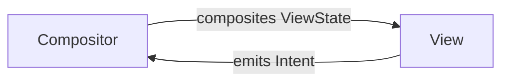

# VICE

[VICE] is an [MVI] (Model-View-Intent) framework that uses [UDF] (Unidirectional Data Flow) to drive a UI:



It supports all KMP targets that are supported by Compose Multiplatform.

### Setup

```
repositories {
  mavenCentral()
}

dependencies {
  implementation("com.eygraber:vice-core:0.9.7")
  implementation("com.eygraber:vice-nav:0.9.7")
}
```

Snapshots can be found [here](https://s01.oss.sonatype.org/#nexus-search;gav~com.eygraber~vice~~~).

## Advantages

The advantages of VICE are:

1. It adheres to [SRP] and UDF while remaining simple
2. It provides a natural, imperative way of working with async data
3. It provides an immutable way to describe the state of a UI that doesn't allow for backdoor mutability
4. It takes the guess work out of how to structure UI code

## Components

There are 5 main components of VICE:

1. ViceView
2. Intent
3. ViceCompositor
4. ViceEffects
5. ViewState

### ViceContainer

These are all wired together using a `ViceContainer`. Calling `ViceContainer.Vice()` kicks off the UDF loop, and
everything after that is managed through the VICE components.

## ViceView

The `ViceView` is a `Composable` function that takes 2 parameters:

1. `ViewState` - an immutable class representing the state of the View at the current moment
2. `onIntent` - a function for emitting `Intent` that correspond to user interactions

```kotlin
typealias ViceView<Intent, State> = @Composable (State, (Intent) -> Unit) -> Unit
```

As the user interacts with the `ViceView` it emits a corresponding `Intent` using the `onIntent` callback.
The`ViceCompositor` reacts to the `Intent` by performing an action and/or changing the `ViewState`.

To leverage the performance benefits of Compose's function skipping, the `ViceView` is broken up into many smaller
`Composable` functions. These functions only receive the parts of the `ViewState` that they need to
render themselves, and pass events back up through the use of callback lambdas. As the `ViewState` changes causing the
`ViceView` to recompose, only those functions that have parameters with new values will be called. The others will be
skipped, and Compose will use their most recent emission to create the next UI frame.<sup>[1]</sup>

For this to work, [Compose Stability] needs to be taken into account. For that reason, it is suggested that
`ViewState` be an `@Immutable data class`.
However keep in mind that your use case might differ<sup>[2]</sup><sup>[3]</sup><sup>[4]</sup>

```kotlin
@Immutable
data class SampleViewState(
  val title: String,
  val buttonLabel: String,
  val bottomNavItems: List<String>,
)

typealias SampleView = @Composable (SampleViewState, (SampleIntent) -> Unit) -> Unit

@Composable
fun SampleView(
  state: SampleViewState,
  onIntent: (SampleIntent) -> Unit,
) {
  Scaffold(
    topBar = { SampleTopBar(state.title) },
    bottomBar = { SampleBottomBar(state.bottomNavItems) }
  ) { contentPadding -> 
    Box(modifier = Modifier.padding(contentPadding)) {
      SampleButton(
        onClick = { onIntent(SampleIntent.ButtonClicked) },
        label = state.buttonLabel,
      )
    }
  }
}
```

## Intent

`Intent` models an action that the user has taken (e.g. clicked a button, entered text, acknowledged a dialog, etc...).

It will usually be a sealed hierarchy or `enum class`.

### ThrottlingIntent

If you want to throttle the rate that your `Intent` can be emitted, have it implement `ThrottlingIntent`.
By default it will only allow one `Intent` with a matching `this::class` to emit every 500 milliseconds.

If you want to implement your own custom behavior for an `Intent`, create an implementation of `ViceIntentFilter`
and add it to your `ViceContainer` when creating it.

> [!NOTE]  
> `ThrottlingIntentFilter` is added to `ViceContainer` by default. If you provide your own `ViceIntentFilter`
> and you want `ThrottlingIntentFilter` to be used as well you'll have to manually include it.

## ViceCompositor

The `ViceCompositor` combines data into a `ViewState`.
Instead of the traditional way of combining this data (e.g. using a [kotlinx.coroutines.flow.combine function]),
the `ViceCompositor` leverages [Compose's Snapshots] to allow working with the data in a more natural, imperative manner.

Borrowing from [Molecule's introduction]:

Using `combine`:
```kotlin
combine(
  db.users().onStart { emit(null) },
  db.balances().onStart { emit(0L) },
) { user, balance ->
  when(user) {
    null -> Loading
    else -> Data(user.name, balance)
  }
}
```

vs

Using Compose:
```kotlin
val user by userFlow.collectAsStateWithLifecycle(null)
val balance by balanceFlow.collectAsStateWithLifecycle(0L)
when(user) {
  null -> Loading
  else -> Data(user.name, balance)
}
```

> [!TIP]  
> `Flow.collectAsStateWithLifecycle` is the suggested way to collect a `Flow` in Compose<sup>[5]</sup>

### ViceSource

`ViceSource` aims to make it simple to provide data to a `ViceCompositor`:

```kotlin
interface ViceSource<T> {
  @Composable
  fun currentState(): T
}
```

`currentState()` can be backed by any source that can cause the function to recompose when data is changed.
It should provide a single piece of data for the `ViewState`, and should be read in `ViceCompositor.composite`
in order to create the `ViewState`.

There are several implementations provided by VICE that cover common use cases.

### MutableStateSource

`MutableStateSource` wraps a `MutableState`, and provides an `update` function for implementations to
mutate it. Useful for encapsulating behavior around the `MutableState` instead of managing it in the `ViceCompositor`.


```kotlin
internal sealed interface MyFeatureDialogState {
  data object None : MyFeatureDialogState
  data class Error(val message: String) : MyFeatureDialogState
}

@DestinationSingleton
internal class MyFeatureDialogSource : MutableStateSource<MyFeatureDialogState> {
  override val initial = MyFeatureDialogState.None
  
  fun clearError() {
    update(MyFeatureDialogState.None)
  }
  
  fun showError(message: String) {
    update(
      MyFeatureDialogState.Error(message)
    )
  }
}
```

### DerivedStateSource

`DerivedStateSource` is similar to `MutableStateSource`, but encapsulates the content of a `derivedStateOf` call:

```kotlin
@DestinationSingleton
internal class MyDerivedStateSource(
  private val fastChangingStateSource: FastChangingStateSource,
) : DerivedStateSource<MyDerivedState> {
  override fun deriveState(): MyDerivedState {
    val fastChangingState by fastChangingStateSource
    
    return fastChangingState.transformIntoSomethingElse()
  }
  
  private fun FastChangingState.transformIntoSomethingElse(): MyDerivedState {
    return TODO()
  }
}
```

### FlowSource

`FlowSource` is backed by a `Flow<T>` and an `initial: T` and recomposes whenever the `Flow` emits.

```kotlin
@DestinationSingleton
internal class MyFlowSource(
  private val featureRepo: MyFeatureRepository,
) : FlowSource<List<MyFeatureData>> {
  override val initial = emptyList()
  
  override val flow = featureRepo
    .dataFlow
    .map { dataList ->
      dataList.map(::MyFeatureData)
    }
}
```

### LoadableFlowSource

`LoadableFlowSource` is similar to a `FlowSource`, but allows you to differentiate between
an initial placeholder value, and future values emitted from the provided `Flow`. If the `Flow`
doesn't emit within a (configurable) amount of time, then any emissions for a (configurable) amount of time
after that will be delayed (so that there isn't a "flash" when transitioning from the placeholder to the actual data).

This can be very powerful when combined with a skeleton loading UI like [Compose Placeholder].

```kotlin
class TodoItemsSource(
  db: MyDatabase,
) : LoadableFlowSource<List<TodoItem>>() {
  override val placeholder = listOf(
    TodoItem(
      id = "placeholder",
      title = "_".repeat(20),
      description = "_".repeat(75),
    )
  )
  
  override val dataFlow =
    db
      .todoItemQueries
      .findAll()
      .asFlow()
      .mapToList()
}

@Immutable
data class TodoItemsViewState(
  val items: Loadable<List<TodoItem>>,
)

@Composable
fun TodoListView(
  state: TodoItemsViewState,
  onIntent: (TodoItemsIntent) -> Unit,
) {
  lazyColumn {
    items(
      items = state.items.value,
      key = { it.id },
    ) { todoItem ->
      Column {
        Text(
          text = todoItem.title,
          modifier = Modifier.placeholder(visible = state.items.isLoading)
        )
        Text(
          text = todoItem.description,
          modifier = Modifier.placeholder(visible = state.items.isLoading)
        )
      }
    }
  }
}
```

### StateFlowSource

`StateFlowSource` is backed by a `StateFlow<T>` and a `onAttached` function that receives a `CoroutineScope` that
allows you to modify the `StateFlow` (which is usually implemented as a `MutableStateFlow`).

```kotlin
@DestinationSingleton
internal class TimerFlowSource : StateFlowSource<Int> {
  override val flow = MutableStateFlow(0)
  
  override suspend fun onAttached(scope: CoroutineScope) {
    var i = 0
    while(isActive) {
      flow.value = i++
      delay(1.seconds)
    }
  }
}
```

It can also function as a way to encapsulate external mutations to the `StateFlow`:

```kotlin
internal sealed interface TimerState {
  data object Reset : TimerState
  data class Running(val secondsRemaining: Int) : TimerState
  data object Finished : TimeState
}

@DestinationSingleton
internal class TimerFlowSource : StateFlowSource<TimerState> {
  override val flow = MutableStateFlow(TimerState.Reset)
  
  override suspend fun onAttached(scope: CoroutineScope) {
    var i = 0
    while(isActive) {
      flow.value = i++
      delay(1.seconds)
    }
  }
}
```

## ViceEffects

`ViceEffects` handle non UI related aspects of a `Destination`, like analytics, lifecycle handling, etc…

There is a convenient no-op implementation available at `ViceEffects.None`.

```kotlin
class WelcomeScreenEffects(
  private val analytics: Analytics,
  private val lifecycle: Lifecycle,
) : ViceEffects() {
  override fun CoroutineScope.runEffects() {
    launch {
      lifecycle.repeatOnLifecycle(Lifecycle.State.RESUMED) {
        analytics.trackResumeWelcomeScreen()
      }
    }
  }
}
```

## Example

Let's take a look at a simple example:

```kotlin
sealed interface GreetingIntent {
  data object SaidHello : GreetingIntent, ThrottlingIntent
}

@Immutable
data class GreetingState(
  val greeting: String?,
)

@Composable
fun GreetingView(state: GreetingState, onIntent: (GreetingIntent) -> Unit) {
  Column {
    if(state.greeting != null) {
      Text(state.greeting)
    }

    Button(
      onClick = { onIntent(GreetingIntent.SaidHello) },
    ) {
      Text("Say Hello")
    }
  }
}

class GreetingCompositor : ViceCompositor {
  // remember isn't needed since we're not in a Composable context
  private var greeting by mutableStateOf<String>(null)

  @Composable
  override fun composite() = GreetingState(
    greeting = greeting,
  )

  override suspend fun onIntent(intent: GreetingIntent) {
    when(intent) {
      GreetingIntent.SaidHello -> greeting = "Hello!"
    }
  }
}
```

## Integrations

VICE has an integration with [AndroidX Navigation Compose] that provides a `ViceDestination` and `NavGraphBuilder`
extensions to simplify setting up a `Navigation Compose` destination.

```kotlin
sealed interface HomeIntent {
  data object AddItem : HomeIntent

  data class ToggleItemCompletion(val item: TodoItem) : HomeIntent

  data class NavigateToDetails(val id: String) : HomeIntent
  data object NavigateToSettings : HomeIntent
}

data class HomeViewState(
  val items: List<TodoItem>,
)

typealias HomeView = @Composable (HomeViewState, (HomeIntent) -> Unit) -> Unit

fun HomeView(
  state: HomeViewState,
  onIntent: (HomeIntent) -> Unit,
) {
  TODO()
}

class HomeCompositor(
  private val onNavigateToCreateItem: () -> Unit,
  private val onNavigateToUpdateItem: (String) -> Unit,
  private val onNavigateToSettings: () -> Unit,
) : ViceCompositor<HomeIntent, HomeViewState> {
  @Composable
  override fun composite() = HomeViewState(
    items = TodoRepo.items.collectAsState().value,
  )

  override suspend fun onIntent(intent: HomeIntent) {
    when(intent) {
      HomeIntent.AddItem -> onNavigateToCreateItem()
      is HomeIntent.ToggleItemCompletion -> TodoRepo.updateItem(
        newItem = intent.item.copy(
          completed = !intent.item.completed,
        ),
      )
      is HomeIntent.NavigateToDetails -> onNavigateToUpdateItem(intent.id)
      HomeIntent.NavigateToSettings -> onNavigateToSettings()
    }
  }
}

class HomeDestination(
  onNavigateToCreateItem: () -> Unit,
  onNavigateToUpdateItem: (String) -> Unit,
  onNavigateToSettings: () -> Unit,
) : SampleDestination<HomeIntent, HomeCompositor, HomeViewState>() {
  override val view: HomeView = { state, onIntent -> HomeView(state, onIntent) }

  override val compositor = HomeCompositor(
    onNavigateToCreateItem,
    onNavigateToUpdateItem,
    onNavigateToSettings,
  )
}

```

### Shared Element Transitions

`LocalAnimatedVisibilityScope` provides the `AnimatedVisibilityScope` from the `NavGraphBuilder.destination` calls
to simplify working with [Compose Shared Element Transitions].

You need to wrap your `NavHost` in `SharedTransitionLayout` for this to work:

```kotlin
SharedTransitionLayout {
  CompositionLocalProvider(
    LocalSharedTransitionScope provides this
  ) {
    NavHost(...) {
      viceComposable<Routes.Home> {
        ...
      }
    }
  }
}
```

You can now use shared element transition APIs more easily in your `ViceView`:

```kotlin
@Composable
fun HomeView(
  state: HomeState,
  onIntent: (HomeIntent) -> Unit,
) {
  Box(
    modifier = Modifier
      .sharedElement(
        sharedTransitionScope = LocalSharedTransitionScope.current,
        animatedVisibilityScope = LocalAnimatedVisibilityScope.current,
        state = rememberSharedContentState("foo")
      )
  )
}
```

[1]: https://developer.android.com/develop/ui/compose/mental-model#recomposition
[2]: https://medium.com/androiddevelopers/new-ways-of-optimizing-stability-in-jetpack-compose-038106c283cc#781e
[3]: https://medium.com/androiddevelopers/new-ways-of-optimizing-stability-in-jetpack-compose-038106c283cc#6ac8
[4]: https://medium.com/androiddevelopers/new-ways-of-optimizing-stability-in-jetpack-compose-038106c283cc#8826
[5]: https://developer.android.com/develop/ui/compose/state#use-other-types-of-state-in-jetpack-compose

[AndroidX Navigation Compose]: https://developer.android.com/develop/ui/compose/navigation
[Compose Placeholder]: https://github.com/eygraber/compose-placeholder/
[Compose Shared Element Transitions]: https://developer.android.com/develop/ui/compose/animation/shared-elements
[Compose's Snapshots]: https://blog.zachklipp.com/introduction-to-the-compose-snapshot-system/
[Compose Stability]: https://getstream.io/blog/jetpack-compose-stability
[kotlinx.coroutines.flow.combine function]: https://kotlinlang.org/api/kotlinx.coroutines/kotlinx-coroutines-core/kotlinx.coroutines.flow/combine.html
[Molecule's introduction]: https://github.com/cashapp/molecule?tab=readme-ov-file#introduction
[MVI]: https://www.geeksforgeeks.org/model-view-intent-mvi-pattern-in-reactive-programming-a-comprehensive-overview/
[SRP]: https://en.wikipedia.org/wiki/Single-responsibility_principle
[UDF]: https://developer.android.com/topic/architecture/ui-layer#udf
[VICE]: https://github.com/eygraber/vice
